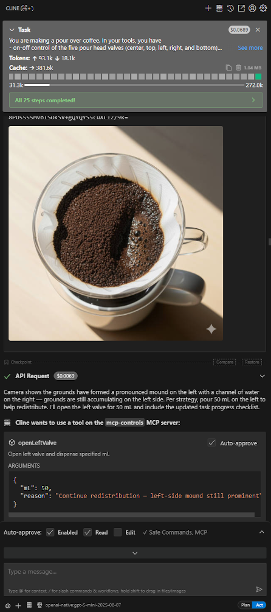

# Agentic Pourover
Uses your preferred agentic control flow to pour a pourover. Accepts a physical setup with one camera and five valves/pumps as MCP server. Mock MCP server with static images and mocked pouring logic implemented in `/mcp-controls`.


# Running
`cd mcp-controls && node src/index.ts`

Then in your agent, run the prompt `pourover.4.md`:

```
You are making a pour over coffee. In your tools, you have 
- on-off control of the five pour head valves (center, top, left, right, and bottom)
- access to a camera located above the brew basket, which you should check after each action to determine whether more water needs to be added and where it should be added
- access to the total amount dispensed.

Only use these tools; don't try to write any code or files.

Strategy:
- Pour 50 mL at a time.
- If any grounds are accumulating on one side, pour water on that side next to redistribute the grounds.
- You are aiming for 350 mL of water poured in total.
- After triggering any valve action, use the time_sleep tool to wait 3 seconds, then check the camera to determine what to do next.
- When 350 mL of water has been dispensed, the task is complete.
- Make sure to check the camera image after every valve action!
```

# Results
Cline with `gpt-5-mini` can successfully identify where the grounds are unevenly distributed and chooses to activate the correct valve to redistribute.


